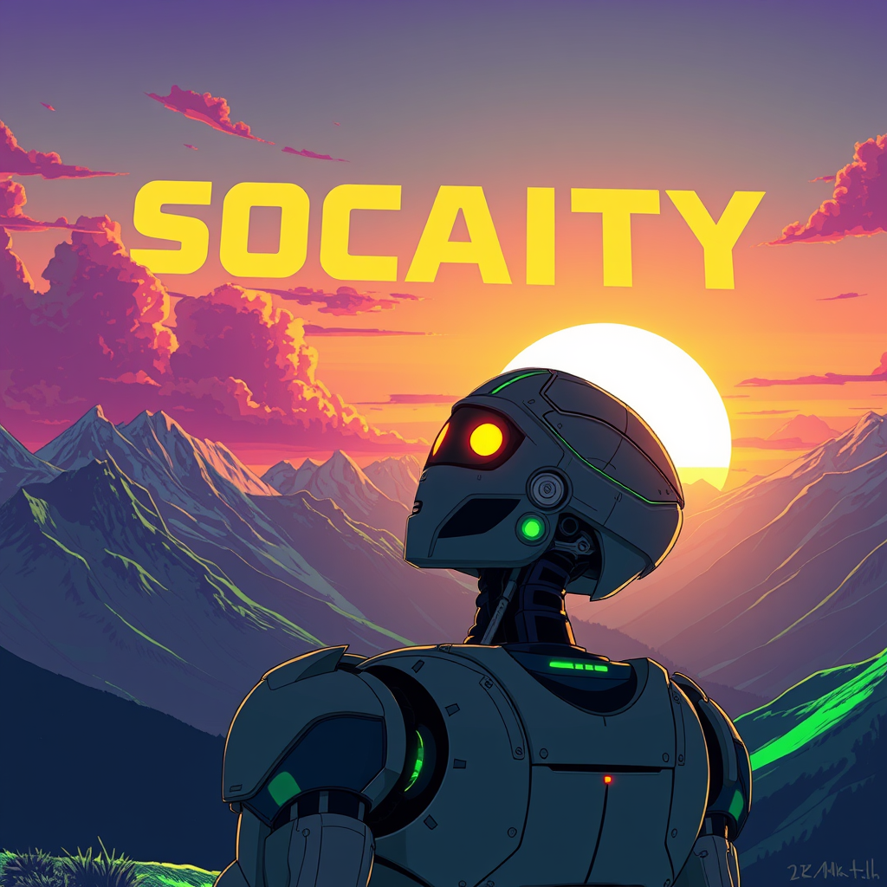

  <h1 align="center" style="margin-top:-25px">SocAIty SDK</h1>
<p align="center">
  
</p>
  <h2 align="center" style="margin-top:-10px">Your SDK and model zoo for generative AI. </h2>


The SDK provides generative models and AI tools across all domains including text, audio, image and more. 
Think of it as open-CV for generative AI. 
It allows you to run models as simple python functions. No GPU or AI knowledge required.

If you are a Software Engineer, Game Developer, Artist, Content Creator and you want to automate with AI this SDK is for you.

For an overview of all models and to obtain an API key visit [socaity.ai](https://www.socaity.ai)

Run models as if they were python functions nomatter where they are deployed:
- hosted on socaity servers (default)
- deployed on your localhost / your own server- hybrid deployment

You can focus on your app, while we handle all the complicated stuff under the hood.

<hr />

Quicklinks:
- Model Zoo

<hr />

# Getting started

## Installation
Install the package from PyPi
```python
pip install socaity
```

## Authentication

For using socaity.ai services you need to set the environment variable `SOCAITY_API_KEY`.
You can obtain an API key from [socaity.ai](https://www.socaity.ai) after signing up.
Now you are ready to use the SDK.

**Alternatively** you can set the API key in your code when using the SDK. 
We don't recommend this, as it a common mistake to push your code including your API key to a public repository.
```python
from socaity import FluxSchnell
flux_schnell = FluxSchnell(service="socaity", api_key="sai..your_api_key")
flux_schnell.text2img("A beautiful sunset in the mountains")
```

If you **instead** want to directly communicate with your runpod services or replicate you can set 
the environment variable `RUNPOD_API_KEY` or `REPLICATE_API_KEY`.
When initializing your ModelClient you can additionally pass which provider you want to use by using "service" parameter.


# Overview

1. How it works: Explains the concept of the SDK
2. Generative AI - model zoo: Overview of the models and services provided
3. Setup: How to install the SDK
5. Usage: How to use the SDK


## Quick start

Import a model from the model-zoo or just use the simple API (text2img, text2speech etc.)
```python
from socaity import FluxSchnell, text2speech, text2img
```
Then you can use it as a function
```python
flux_schnell = FluxSchnell().text2img("A beautiful sunset in the mountains")
my_image = text2img("A beautiful sunset in the mountains").get_result()
```

### Example 1: Combine llm, text2img and text2speech

We will use different models to showcase how to create for example a perfect combination for a blog.
```python
from socaity import DeepSeekR1, text2voice, text2img

deepseek = DeepSeekR1()
poem = deepseek.chat("Write a poem with 3 sentences why a SDK is so much better than plain web requests.").get_result()
poem = deepseek.pretty(poem)

audio = text2voice(poem, model="speechcraft", voice="hermine")

my_image_prompt = """
A robot enjoying a stunning sunset in the alps. In the clouds is written in big letters "SOCAITY SDK".
The sky is lit with deep purple and lime colors. It is a wide-shot.
The artwork is striking and cinematic, showcasing a vibrant neon-green lime palette, rendered in an anime-style illustration with 4k detail. 
Influenced by the artistic styles of Simon Kenny, Giorgetto Giugiaro, Brian Stelfreeze, and Laura Iverson.
"""

image = text2img(text=my_image_prompt, model="flux-schnell", num_outputs=1)
audio.get_result().save("sdk_poem.mp3")
image.get_result().save("sdk_poem.png")
```
This results in something like this:



The package sends web requests to models hosted behind REST APIs.
All the networking, speed optimization, and error handling is done in the package._


Run models (and services) as if they were python functions:

Model deployment type    | Description                                                    | Pros                        | Cons
-------------            |----------------------------------------------------------------|-----------------------------| ------------
Locally         | Install genAI packages on your machine and use it with socaity | Free, Open-Source           | GPU needed, more effort
Hosted  | Use the AIs hosted on socaity servers.                         | Runs everywhere, Ultra-easy | None
Hybrid | Deploy some services on your servers and use others from       | Full flexibility            | More effort


# Generative AI - model zoo

The models are categorized by their domain and use-case.

### Audio domain

Use-Case      | Description                                               | Repositories | Models
------------- |-----------------------------------------------------------| ------------- | ------------
text2voice | Convert text to natural sounding speech. In many languages | SpeechCraft | Bark
voice2voice  | Convert one persons voice to another.                     | Voice2Voice | RVC
audio2face | Create expressive facial animation from audio.            | pyAudio2Face | audio2face

### Image domain
Use-Case      | Description                                    | Repositories | Models
------------- |------------------------------------------------|--------------| ------------
face2face | Swap faces in images. Deep fakes.              | face2face    | inswapper_128
text2image | Convert an image description to expressive art | coming soon  | StableDiffusion, AuraFlow
face-restoration | Restors, bad quality or distorted faces in images | face2face    | GPEN

### Animation
Use-Case      | Description                                                | Models
------------- |------------------------------------------------------------| -------------
audio2face | Create expressive facial animation from audio.             | nvidia auio2face
text2face | Convert text to audio and then to facial animation.         | text2speech, audio2face

### Text domain
Use-Case      | Description               | Models
------------- |---------------------------| -------------
chat | Text-generation with LLMs | chat-gpt, claude

# AI - model zoo

Socaity provides a model zoo for recognition AI models. The models are categorized by their domain and use-case.
### Image domain
Use-Case      | Description                                       | Repositories | Models
------------- |---------------------------------------------------|--------------| ------------
face-recognition | Identify persons in images                        | Face2Face    | inswapper_128


# Usage
We provide two APIs for inferencing, SimpleAPI and ClientAPI.
The simpleAPI is literally a wrapper for the ClientAPI but simplifies the usage of the models.

## Simple API
The simple API contains functions for the most use-cases. Behind

```python
from socaity import text2speech, text2img, voice2voice
text2speech("Hello World")
```

This code internally initializes an API client from the ClientAPI and uses it.


# Working locally or with other providers

Any service that is [fastSDK](https://github.com/SocAIty/fastsdk) compatible  (openAPI / [fastTaskAPI](https://github.com/SocAIty/FastTaskAPI), replicate and [runpod](https://www.runpod.io/)) 
can be used with this package. 

## Client API

The ClientAPI comes with predefined classes for the most used models.

## async usage
```python
from socaity import Bark, await_result
job = Bark("localhost").run("Hello", affe=2) 
audio, sample_rate = await_result(job)  # this is a blocking call until the job is finished
```
A ClientAPI defines pre -and post-processing functions and utility functions for those models.
You can identify clientAPIs by a UpperCamelCase name or import them directly from the submodules api.*.

The clientAPI also provides the possibility to:
- specify an exact endpoint type like "localhost"
- the provider


## How does the ClientAPI work?
Internally a ClientAPI:
1. creates a client with predefined endpoint parameters
2. on call creates a job and submits it to the client
3. returns the result of the job


# Important Note
- PACKAGE IS IN ALPHA RELEASE. RAPID CHANGES TO SYNTAX AND FUNCTIONALITY NEED TO BE EXPECTED
- LEAVE A STAR TO SUPPORT THIS WORK AND FOR MORE MODELS BEING ADDED TO THE LIBRARY

