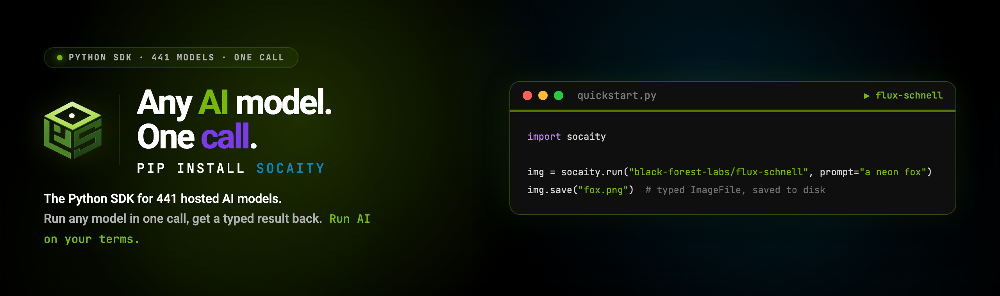

<p align="center">
  
</p>

<p align="center">
  <a href="https://pypi.org/project/socaity/"></a>
  <a href="https://pypi.org/project/socaity/"></a>
  <a href="https://www.socaity.ai"></a>
</p>

<h3 align="center">Any AI model. One call. Run AI on your terms.</h3>

<p align="center">
  441 hosted models across image, audio, video and text, called like plain Python functions.<br>
  No GPU, no infrastructure, no AI background required.
</p>

## Install

```bash
pip install socaity
```

Grab a key at [socaity.ai](https://www.socaity.ai) and set it once:

```bash
export SOCAITY_API_KEY="sk_..."
```

## Quick start

One call installs the model, runs it, and returns a typed result:

```python
import socaity

img = socaity.run("black-forest-labs/flux-schnell", prompt="a neon fox")
img.save("fox.png")
```

That is the whole loop. `socaity.run` reads your key from `SOCAITY_API_KEY`, so there is nothing else to wire up.

## Working with models directly

`run` is the shortcut. When you want the typed client (autocomplete, named parameters, reuse), install the model once and import it:

```python
import os
import socaity

socaity.install("deepseek-ai/deepseek-v3")        # generates the typed client

from socaity.replicate.deepseek_ai import deepseek_v3

llm = deepseek_v3(api_key=os.getenv("SOCAITY_API_KEY"))
job = llm(prompt="write a haiku about cold starts")   # returns a job, does not block
text = "".join(str(chunk) for chunk in job.get_result())
```

Every call returns a job immediately, so you can start several and collect them later. Hosted models live under `socaity.replicate.<vendor>`, with names normalized to valid Python (for example `black-forest-labs` becomes `black_forest_labs`).

You can also install from the command line (run `socaity login` once first):

```bash
socaity install black-forest-labs/flux-schnell
```

## Results and files

A call with a single output returns one typed object. Ask for more and you get a list:

```python
imgs = socaity.run("black-forest-labs/flux-schnell", prompt="a neon fox", num_outputs=4)
for i, img in enumerate(imgs):
    img.save(f"fox_{i}.png")
```

Inputs and outputs are typed media objects (`ImageFile`, `AudioFile`, `VideoFile`), importable straight from the package:

```python
from socaity import ImageFile

portrait = ImageFile().from_file("portrait.jpg")
```

## Models

441 hosted models, Replicate backed, across every domain:

| Domain | Examples |
|--------|----------|
| Image  | `black-forest-labs/flux-schnell`, `tencentarc/gfpgan` |
| Text   | `deepseek-ai/deepseek-v3`, `meta/meta-llama-3-70b` |
| Audio  | `jaaari/kokoro-82m`, `vaibhavs10/incredibly-fast-whisper` |
| Video  | `tencent/hunyuan-video` |

The full, always current list lives at [socaity.ai](https://www.socaity.ai).

## Local and self hosted

Open source services like [face2face](https://github.com/SocAIty/face2face) and [SpeechCraft](https://github.com/SocAIty/SpeechCraft) are not in the hosted catalog. Run them yourself with [APIPod](https://github.com/SocAIty/APIPod) and drive them through the same SDK. Anything [fastSDK](https://github.com/SocAIty/fastSDK) compatible (OpenAPI, APIPod, Replicate, RunPod) plugs in.

| Where it runs | Trade off |
|---------------|-----------|
| Hosted on socaity.ai | zero setup, always current, slight cost |
| Local on your machine | free and open source, needs a GPU |
| Hybrid, RunPod or local plus socaity | full control, more effort |

We handle the DevOps. You ship the app.

## Status

Alpha. Expect rapid changes to syntax and surface. Issues and pull requests are welcome.
